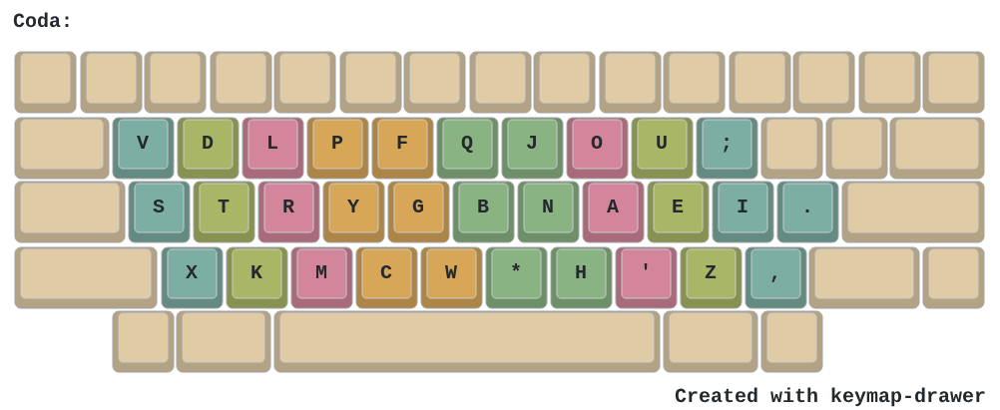
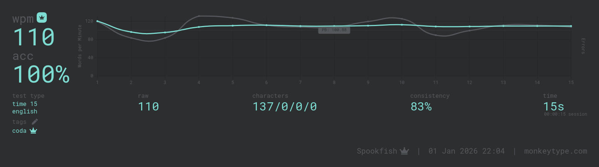

# CODA
Coda is my solution to bring 'magic' to standard hardware keyboards. You can use it anywhere you can install your own software. It was designed from the ground up with magic in mind using tools like Oxeylyzer with a repeat corpus, and Mana for analysis.



```
coda | monkeyracer
  v d l p f q j o u ;
  s t r y g b n a e i .
  x k m c w * h ' z ,

Magic rules: aa cc dd ee ff gg hh ii jj kk ll mm oo pp qq rr ss tt ue vv ww xx yy ze '' ..

Heatmap score: 74.263%
Handbalance: 43.892% / 56.108%

Alt: 37.508%
Rolls (Total): 54.579%
  Inroll: 22.786%
  Outroll: 29.692%
  In3roll: 1.041%
  Out3roll: 1.061%
Redirect (+sfs): 6.164%
  Redirect (Weak) (+sfs): 0.439%

┌────────────────┬──────────┬────────────┬─────────────┐
│                │  bigram  │  skipgram  │  skipgram2  │
├────────────────┼──────────┼────────────┼─────────────┤
│  same finger   │  0.613%  │  6.351%    │  8.208%     │
│  repeat        │  0.112%  │  3.077%    │  --         │
│  stretch       │  2.348%  │  4.615%    │  3.441%     │
│  half scissor  │  1.744%  │  3.416%    │  2.277%     │
│  full scissor  │  0.444%  │  0.855%    │  1.429%     │
└────────────────┴──────────┴────────────┴─────────────┘
```
(stats via Mana, notably redirect stats in Mana include sfs)

# Magic?
A 'magic' key is a key that produces a different output in different situations. In most cases the most useful output will be a repeat of the previous key, so "l*" outputs "ll" (fixing so-called 'same finger repeats'). Some keys don't ever repeat, or do so extremely rarely. In those cases we can look for other uses such as "u*" -> "ue", which fixes a 'same finger bigram' found in many modern layouts. You can also override a key with frequent repeats if you feel there is a more useful sequence. The default rules are intended to be uncontroversial.

We can go beyond single letter magic and have "y*" -> "you", or "b*" -> "because". Similarly we can broaden the context our magic rules consider and take into account multiple previous key presses. Within Kanata we do this via 'key-history' to set rules such that "u*" -> "ue", but "ou*" -> "ou'".

While this enables a great degree of complexity, even simple rules can substantially improve the typing experience.

# About the layout
I didn't set out to maximise a particular stat, just to make something solid with the added challenge of squeezing a new key onto an already tightly packed board. Where I ended up is similar to the pre-existing layout Sturdy, and so shares many attributes with it.

It favours rolls to alts, features low pinky usage, very low sfb's, low weak redirects, and extremely low half scissors. It's also one of the most vim friendly alt layouts I've seen with J taking an unusually nice spot and no important keys in bad spots. Even analyzed sans magic, the stats place it right alongside other modern layouts.

As far as weaknesses go, the 'lrm' middle finger column is quite high movement and is the reason for the slightly high SFS stat. It's on a strong finger so I don't find it to be an issue but nevertheless it is a drawback.

# Alt fingerings
There are no mandatory alts here but there are a couple of nice ones for those who are interested.

The biggest sfb is '*n', which for this layout would occur on 'oon' 'een', etc. This is a very nice alt if you hit '*' with index and 'n' with middle. Doing this alt brings the total sfbs below 0.5% (on the Monkeyracer corpus).

'lm' is far less common, but it's a 2u sfb which is bad. This can be alted with 'l' on the middle finger and 'm' on index.

# Are repeats really a big deal?
This is ultimately a personal decision, but I'll present my reasons for concluding that they are.

A repeat is a same finger bigram, there's just no movement so we could call it a 0u sfb. It's counter intuitive but some people type 0u sfbs *slower* than 1u sfbs, this could be influenced by the type of keyboard being used. To get a first hand sense of how fast you type 0u sfbs I recommend spending some time on [zippywords](https://zippywords.com). See how fast you type repeats and how comfortable you find hitting them as fast as possible. Some of the fastest qwerty typists are also adding a repeat to their layout on Capslock or a punctuation key.

# In closing
I made this layout because I wished it existed and it didn't. It's my main layout and I don't see myself switching unless someone figures out a significantly better repeat/magic setup for rowstag. I cannot see myself returning to a muggle layout by choice. Current Coda speed:



I'd like to say thank you to Oxey (see:[Oxeylyzer](https://github.com/O-X-E-Y/oxeylyzer)) and Zak (see:[Mana](https://github.com/Zakkkk/mana)) for their tools that did most of the heavy lifting, Nova (Kanata config repo coming soon) for trying an earlier version and giving feedback, and the AKL discord in general for being a helpful friendly place.
